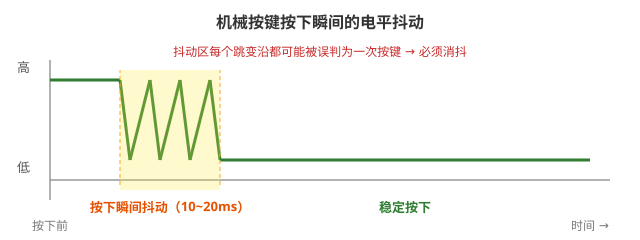

# 学习笔记 | 2026-08-12

## 今日主题：按键消抖 · 外部中断 · 电机 PWM 控制（6-5 工程）

> 工程：`D:\VScodeSTM项目文件夹\6-5PWM电机` | 芯片：STM32F103C8T6 | 标准库 V3.5

---

## 一、核心知识点

### 1.1 按键消抖：为什么必须消抖？

机械按键按下瞬间触点会**弹跳**，电平在 10~20ms 内反复变化，一次按下可能被识别成多次：



> 图中黄色区间就是抖动区：每个跳变沿都可能被误判为一次按键，所以必须消抖。

### 1.2 三种消抖方法对比

| 方法 | 原理 | 阻塞 CPU？ | 适用场景 | 代码量 |
|---|---|---|---|---|
| ① 阻塞延时 | 检测到变化 → `Delay_ms(20)` 再确认 | ✅ 阻塞 | 学习实验、单按键 | 最少 |
| ② 时间戳消抖 | 记录变化时刻，主循环查时间差 ≥20ms | ❌ 非阻塞 | 多任务、通用 | 中 |
| ③ 周期采样 | 每 5ms 采样，连续 N 次一致才确认 | ❌ 非阻塞 | 产品级、多按键 | 较多 |

> 💡 **核心思想：用时间差代替 sleep，消抖不阻塞 CPU**

---

## 二、重要代码参考（可直接抄）

### 2.1 SysTick 时间戳模块（时间基准，一切消抖的前提）

```c
// ============ System/Systick.c ============
#include "stm32f10x.h"

volatile uint32_t Systick_Count;      // 1ms 递增一次，全局时间戳

void Systick_Init(void)
{
    // 注意：不要再调 SystemInit()！启动文件已调用过
    SysTick_Config(SystemCoreClock / 1000);   // 1ms 中断
}
```

```c
// ============ System/Systick.h ============
#ifndef __SYSTICK_H
#define __SYSTICK_H

void Systick_Init(void);

#endif
```

```c
// ============ User/stm32f10x_it.c ============
extern volatile uint32_t Systick_Count;   // extern 声明，定义在 Systick.c

void SysTick_Handler(void)                // 1ms 中断服务函数
{
    Systick_Count++;
}
```

> ⚠️ **坑**：`Systick_Init` 里别再写 `SystemInit()`——启动文件 `startup_xxx.s` 上电时已经调用过一次，重复调用会干扰时钟。

---

### 2.2 时间戳消抖 + 外部中断（推荐写法：中断只置标志）

```c
// ============ HardWare/Key.c ============
#include "stm32f10x.h"
#include "Motor.h"

volatile uint32_t Exit_Time;    // 中断里记录按下时刻
volatile uint8_t  flat;         // 中断标志：0=无 1=PA3 2=PA5
extern volatile uint32_t Systick_Count;

void Key_Init(void)
{
    // 1. GPIO：上拉输入
    RCC_APB2PeriphClockCmd(RCC_APB2Periph_GPIOA, ENABLE);
    GPIO_InitTypeDef GPIO_InitStruct;
    GPIO_InitStruct.GPIO_Mode  = GPIO_Mode_IPU;          // 上拉输入
    GPIO_InitStruct.GPIO_Pin   = GPIO_Pin_3 | GPIO_Pin_5;
    GPIO_InitStruct.GPIO_Speed = GPIO_Speed_50MHz;
    GPIO_Init(GPIOA, &GPIO_InitStruct);

    // 2. AFIO + EXTI：⚠️ 千万别漏 GPIO_EXTILineConfig！
    RCC_APB2PeriphClockCmd(RCC_APB2Periph_AFIO, ENABLE);
    GPIO_EXTILineConfig(GPIO_PortSourceGPIOA, GPIO_PinSource3);  // PA3 → EXTI3
    GPIO_EXTILineConfig(GPIO_PortSourceGPIOA, GPIO_PinSource5);  // PA5 → EXTI5

    EXTI_InitTypeDef EXTI_InitStructure;
    EXTI_InitStructure.EXTI_Line    = EXTI_Line3 | EXTI_Line5;
    EXTI_InitStructure.EXTI_Mode    = EXTI_Mode_Interrupt;
    EXTI_InitStructure.EXTI_Trigger = EXTI_Trigger_Falling;      // 按键接GND，下降沿
    EXTI_InitStructure.EXTI_LineCmd = ENABLE;
    EXTI_Init(&EXTI_InitStructure);

    // 3. NVIC：PA3→EXTI3，PA5→EXTI9_5 组
    NVIC_PriorityGroupConfig(NVIC_PriorityGroup_2);
    NVIC_InitTypeDef NVIC_InitStructure;
    NVIC_InitStructure.NVIC_IRQChannel                   = EXTI3_IRQn;
    NVIC_InitStructure.NVIC_IRQChannelCmd                = ENABLE;
    NVIC_InitStructure.NVIC_IRQChannelPreemptionPriority = 1;
    NVIC_InitStructure.NVIC_IRQChannelSubPriority        = 1;
    NVIC_Init(&NVIC_InitStructure);

    NVIC_InitStructure.NVIC_IRQChannel                   = EXTI9_5_IRQn;
    NVIC_InitStructure.NVIC_IRQChannelCmd                = ENABLE;
    NVIC_InitStructure.NVIC_IRQChannelPreemptionPriority = 1;
    NVIC_InitStructure.NVIC_IRQChannelSubPriority        = 2;
    NVIC_Init(&NVIC_InitStructure);
}

// 中断只做两件事：置标志 + 记录时间（极短，不耗时）
void EXTI3_IRQHandler(void)
{
    if (EXTI_GetITStatus(EXTI_Line3) == SET)
    {
        flat = 1;                  // 只置标志
        Exit_Time = Systick_Count; // 记录按下时刻
        EXTI_ClearITPendingBit(EXTI_Line3);
    }
}

void EXTI9_5_IRQHandler(void)
{
    if (EXTI_GetITStatus(EXTI_Line5) == SET)
    {
        flat = 2;
        Exit_Time = Systick_Count;
        EXTI_ClearITPendingBit(EXTI_Line5);
    }
}
```

> ⚠️ **坑**：漏掉 `GPIO_EXTILineConfig` → EXTI 不触发 → 按键没反应。
> ⚠️ **坑**：按键另一端必须接 GND（接 VCC 的话要改成上升沿触发）。

---

### 2.3 主循环处理：时间戳消抖 + 电平确认（满足条件才清标志）

```c
void Key_Delay(void)
{
    if (flat)                          // 有按键事件？
    {
        switch (flat)
        {
        case 1:                        // PA3
            if (Systick_Count - Exit_Time >= 20)   // ① 消抖：距按下已 20ms
            {
                flat = 0;              // ② 满足条件才清标志！（先清后判会丢事件）
                if (GPIO_ReadInputDataBit(GPIOA, GPIO_Pin_3) == RESET)  // ③ 电平二次确认
                {
                    direction = -direction;        // 方向切换
                    Motor_Direction(direction);
                }
            }
            break;

        case 2:                        // PA5
            if (Systick_Count - Exit_Time >= 20)
            {
                flat = 0;
                if (GPIO_ReadInputDataBit(GPIOA, GPIO_Pin_5) == RESET)
                {
                    speed += 10;                   // 每次 +10
                    if (speed > 99) speed = 99;    // 封顶 99（ARR=99）
                    Motor_Speed(speed);
                }
            }
            break;
        }
    }
}
```

> ⚠️ **坑**：`flat` 必须**满足条件后才清零**。如果"看到标志就清"，抖动超过阈值时会丢失按键事件。
> 💡 三重防护：时间戳消抖 → 清标志 → 电平确认，缺一不可。

---

### 2.4 电机驱动（方向 + 速度分离）

```c
// ============ HardWare/Motor.c ============
#include "stm32f10x.h"
#include "PWM.h"

void Motor_Init(void)
{
    PWM_Init();                        // 先初始化 PWM（PA0 / TIM2_CH1）

    RCC_APB2PeriphClockCmd(RCC_APB2Periph_GPIOA, ENABLE);
    GPIO_InitTypeDef GPIO_InitStructure;
    GPIO_InitStructure.GPIO_Mode  = GPIO_Mode_Out_PP;        // 方向引脚：推挽输出
    GPIO_InitStructure.GPIO_Pin   = GPIO_Pin_10 | GPIO_Pin_11;
    GPIO_InitStructure.GPIO_Speed = GPIO_Speed_50MHz;
    GPIO_Init(GPIOA, &GPIO_InitStructure);
}

// 1 正转，-1 反转
void Motor_Direction(int8_t direction)
{
    if (direction == 1)
    {
        GPIO_SetBits(GPIOA, GPIO_Pin_10);    // IN1=1
        GPIO_ResetBits(GPIOA, GPIO_Pin_11);  // IN2=0
    }
    else if (direction == -1)
    {
        GPIO_SetBits(GPIOA, GPIO_Pin_11);    // IN1=0
        GPIO_ResetBits(GPIOA, GPIO_Pin_10);  // IN2=1
    }
}

void Motor_Speed(uint8_t speed)
{
    if (speed > 99) speed = 99;     // ⚠️ 封顶 99（=ARR），不要归零！
    PWM_Changevalue(speed);         // 修改 CCR → 占空比
}
```

```c
// ============ HardWare/PWM.c（TIM2 输出 PWM，PA0）============
#include "stm32f10x.h"

void PWM_Init(void)
{
    // 1. PA0 → 复用推挽输出（TIM2_CH1）
    RCC_APB2PeriphClockCmd(RCC_APB2Periph_GPIOA, ENABLE);
    GPIO_InitTypeDef GPIO_InitStructure;
    GPIO_InitStructure.GPIO_Mode  = GPIO_Mode_AF_PP;        // 复用推挽！
    GPIO_InitStructure.GPIO_Pin   = GPIO_Pin_0;
    GPIO_InitStructure.GPIO_Speed = GPIO_Speed_50MHz;
    GPIO_Init(GPIOA, &GPIO_InitStructure);

    // 2. TIM2 时基：72MHz / 720 / 100 = 1kHz
    RCC_APB1PeriphClockCmd(RCC_APB1Periph_TIM2, ENABLE);
    TIM_InternalClockConfig(TIM2);

    TIM_TimeBaseInitTypeDef TIM_TimeBaseInitStructure;
    TIM_TimeBaseInitStructure.TIM_ClockDivision = TIM_CKD_DIV1;
    TIM_TimeBaseInitStructure.TIM_CounterMode   = TIM_CounterMode_Up;
    TIM_TimeBaseInitStructure.TIM_Period        = 100 - 1;   // ARR = 99
    TIM_TimeBaseInitStructure.TIM_Prescaler     = 720 - 1;   // PSC = 719
    TIM_TimeBaseInitStructure.TIM_RepetitionCounter = 0;
    TIM_TimeBaseInit(TIM2, &TIM_TimeBaseInitStructure);

    // 3. 输出比较：PWM1 模式，高电平有效
    TIM_OCInitTypeDef TIM_OCInitStructure;
    TIM_OCStructInit(&TIM_OCInitStructure);
    TIM_OCInitStructure.TIM_OCMode     = TIM_OCMode_PWM1;
    TIM_OCInitStructure.TIM_OCPolarity = TIM_OCPolarity_High;
    TIM_OCInitStructure.TIM_OutputState = TIM_OutputState_Enable;
    TIM_OCInitStructure.TIM_Pulse      = 0;                  // 初始 0%
    TIM_OC1Init(TIM2, &TIM_OCInitStructure);                 // CH1

    TIM_Cmd(TIM2, ENABLE);            // 启动定时器
}

void PWM_Changevalue(uint8_t value)
{
    TIM_SetCompare1(TIM2, value);     // 修改 CCR1 → 占空比
}
```

---

## 三、今日踩的坑（重点回顾！）

| # | 坑 | 现象 | 原因 | 解法 |
|---|---|---|---|---|
| 1 | 新文件没加入 Keil 工程 | `undefined symbol` | Keil 只编译 `.uvprojx` 登记的文件 | Keil 右键分组 → Add Existing Files |
| 2 | IntelliSense 误报"缺右括号" | VS Code 红×但 Keil 编译过 | compilerPath 配了 ARMCLANG，工程用 ARMCC | 改 `armcc.exe` + `__CC_ARM` |
| 3 | `stdint.h` 找不到 | VS Code 报错 | includePath 缺编译器头文件目录 | 加 `D:/keil/ARM/ARMCC/include` |
| 4 | 中断不触发 | 按键完全没反应 | **漏了 `GPIO_EXTILineConfig`** 映射 | 必须映射 PA3→EXTI3、PA5→EXTI5 |
| 5 | 形参改了没用 | 速度永远不累加 | `value += 10` 改的是副本 | 全局变量或 `static` + 函数接口 |
| 6 | 电机"按键没反应" | 按了不转 | **启动死区**：占空比太小力矩不足 | 加大步进 / 设启动初值 |
| 7 | SysTick 时间戳失效 | 按键永不处理 | Systick.c 重复调 `SystemInit()` | 删掉，启动文件已调用过 |
| 8 | `speed>100` 归零 | 加速到 110 突然停转 | 封顶逻辑写成归零 | 改 `speed = 99` 封顶 |

---

## 四、容易搞混的概念

### 4.1 volatile / extern / static

| 关键字 | 作用 | 什么时候用 |
|---|---|---|
| `volatile` | 防编译器优化，强制重新读内存 | **中断和主循环共享的变量（必须）** |
| `extern` | 声明"变量在别处已定义" | 跨文件使用全局变量 |
| `static` | 文件内私有 | 只想本文件用的全局变量 |

```c
// 标准组合：定义 + 声明 + 使用
volatile uint32_t Systick_Count;             // Systick.c：定义（一次）
extern volatile uint32_t Systick_Count;      // it.c / Key.c：声明（多次）
```

### 4.2 定义 vs 声明

```text
定义：分配内存，全工程只能一次（不带 extern）
声明：extern，不分配内存，可以多次
```

> 口诀：**带 extern 不初始化 = 声明；不带 extern = 定义**

### 4.3 抖动 vs 阈值

```text
抖动 < 阈值 → 正常消抖 ✅
抖动 > 阈值 → 响应延迟（最后边沿 + 20ms），不丢失 ✅
flag 清除时机 → 必须"满足条件才清"！先清后判会丢事件 ❌
```

### 4.4 PWM1 vs PWM2

```text
PWM1/PWM2 决定"哪段时间有效"
OCPolarity 决定"有效时输出高还是低"
等效关系：PWM1+High ≈ PWM2+Low
```

---

## 五、调试方法论（以后复用）

```text
1. 分步定位：硬件 → 中断 → 时间戳
2. 绕过中断做轮询测试，先确认硬件正常
3. OLED 显示关键变量（仪表盘式调试）
4. Keil 命令行编译验证：UV4.exe -b project.uvprojx
```

---

## 六、待办 / 下一步

- [ ] 选择加速方案：A 加大步进 / B 启动初值 / C 非线性加速
- [ ] 按键加 OLED 速度显示
- [ ] 整理 SysTick 模块（消除 `Systick_Count` 重复定义隐患）
- [ ] 长按功能：KEY1 长按 = 加速（中断 + 主循环组合）
- [ ] 练习：独立实现"按住 15ms 就松开"的时间轴推演

---

*笔记格式：核心知识点 → 代码参考 → 踩坑回顾 → 易混概念 → 方法论 → 待办*
