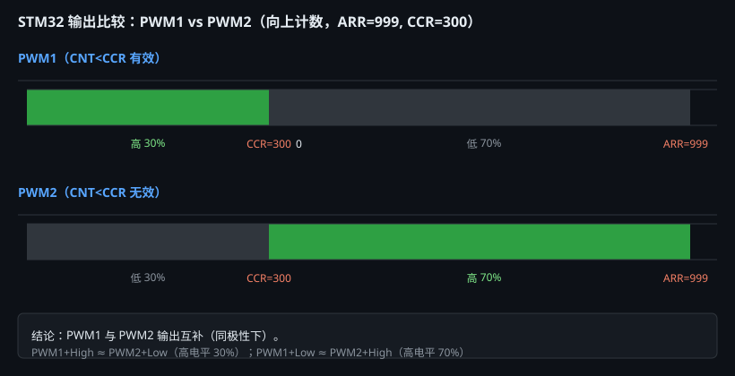

# 学习笔记 | 2026-08-13

## 今日主题：PWM 输出原理 · VS Code/Keil 环境配置 · 按键检测方法

> 芯片：STM32F103C8T6 | 标准库 V3.5 | 涉及工程 `6-5PWM电机`、`6-3LED呼吸灯`

---

## 一、核心知识点

### 1.1 PWM 三要素与核心公式

PWM 输出三个参数：**频率、占空比、幅值**（幅值由 VCC 决定，数字引脚固定 3.3V）。

| 参数 | 公式 | 示例（TIM2=72MHz, PSC=71, ARR=999） |
|---|---|---|
| 频率 | `f = f_TIM / [(PSC+1)(ARR+1)]` | 72M / (72×1000) = **1000 Hz** |
| 占空比 | `Duty ≈ CCR / (ARR+1)` | CCR=500 → **50%** |
| CCR 反推 | `CCR ≈ Duty × (ARR+1)` | 30% → CCR=300 |

⚠️ **PSC/ARR 都是"减1"寄存器**：写 71 实际分频 72，写 999 实际周期 1000。这是最常算错的地方。

### 1.2 ARR 和 CCR 各管什么

```text
PSC 预分频器 → 决定计数速度（时钟频率）
ARR 自动重装值 → 决定一个周期多长（PWM 频率）
CCR 比较寄存器 → 决定高电平多长（占空比）
CNT 计数器 → 从 0 数到 ARR，到顶溢出重来
```

### 1.3 PWM1 vs PWM2 + 极性（四种组合）



核心理解：**OCMode 决定"哪段时间有效"，OCPolarity 决定"有效时输出高还是低"**。

| OC模式 | 极性 | CNT<CCR | CNT≥CCR | 高电平占比 |
|---|---|---|---|---|
| PWM1 | High | 高 | 低 | CCR/(ARR+1) |
| PWM1 | Low | 低 | 高 | 1-CCR/(ARR+1) |
| PWM2 | High | 低 | 高 | 1-CCR/(ARR+1) |
| PWM2 | Low | 高 | 低 | CCR/(ARR+1) |

> 等效关系：`PWM1+High ≈ PWM2+Low`，`PWM1+Low ≈ PWM2+High`（指最终引脚波形相同）。初学默认用 **PWM1+High**：CCR 越大占空比越大，最直观。

### 1.4 TIM2 通道与引脚映射（OC1~OC4 不能乱接）

| 通道 | 功能 | 默认引脚 | 全重映射后 |
|---|---|---|---|
| OC1 | TIM2_CH1 | **PA0** | PA15 |
| OC2 | TIM2_CH2 | **PA1** | PB3 |
| OC3 | TIM2_CH3 | **PA2** | PB10 |
| OC4 | TIM2_CH4 | **PA3** | PB11 |

⚠️ **同一定时器四路频率必须相同**（共用 PSC/ARR/CNT），但占空比可各自不同。要不同频率 → 换不同定时器（TIM2 舵机 50Hz、TIM3 电机 10kHz）。

### 1.5 按键检测四大方法

| 方法 | 原理 | 阻塞 | 适用场景 |
|---|---|---|---|
| ① 阻塞延时 | 检测变化→`Delay_ms(20)`→再确认 | ✅ 阻塞 | 学习实验、单按键 |
| ② 定时器扫描+状态机 | 固定周期扫描，连续 N 次一致 | ❌ | 多按键、产品 |
| ③ 外部中断+消抖 | 边沿触发再确认 | ❌ | 唤醒、低功耗 |
| ④ 矩阵扫描 | 行×列扫描 | ❌ | 键盘、大量按键 |

---

## 二、重要代码参考（可直接抄）

### 2.1 PWM 初始化（标准库，PA0/TIM2_CH1）

```c
void PWM_Init(void)
{
    // GPIO：复用推挽输出
    RCC_APB2PeriphClockCmd(RCC_APB2Periph_GPIOA, ENABLE);
    GPIO_InitTypeDef GPIO_InitStructure;
    GPIO_InitStructure.GPIO_Mode  = GPIO_Mode_AF_PP;   // ⚠️ 复用推挽，不是 Out_PP
    GPIO_InitStructure.GPIO_Pin   = GPIO_Pin_0;
    GPIO_InitStructure.GPIO_Speed = GPIO_Speed_50MHz;
    GPIO_Init(GPIOA, &GPIO_InitStructure);

    // 时基单元
    RCC_APB1PeriphClockCmd(RCC_APB1Periph_TIM2, ENABLE);
    TIM_InternalClockConfig(TIM2);
    TIM_TimeBaseInitTypeDef TIM_TimeBaseInitStructure;
    TIM_TimeBaseInitStructure.TIM_ClockDivision    = TIM_CKD_DIV1;
    TIM_TimeBaseInitStructure.TIM_CounterMode      = TIM_CounterMode_Up;
    TIM_TimeBaseInitStructure.TIM_Period           = 100 - 1;  // ARR
    TIM_TimeBaseInitStructure.TIM_Prescaler        = 720 - 1;  // PSC → 1kHz
    TIM_TimeBaseInitStructure.TIM_RepetitionCounter = 0;
    TIM_TimeBaseInit(TIM2, &TIM_TimeBaseInitStructure);

    // 输出比较
    TIM_OCInitTypeDef TIM_OCInitStructure;
    TIM_OCStructInit(&TIM_OCInitStructure);          // 先赋默认值
    TIM_OCInitStructure.TIM_OCMode      = TIM_OCMode_PWM1;
    TIM_OCInitStructure.TIM_OCPolarity  = TIM_OCPolarity_High;
    TIM_OCInitStructure.TIM_OutputState = TIM_OutputState_Enable;
    TIM_OCInitStructure.TIM_Pulse       = 0;         // 初始占空比 0
    TIM_OC1Init(TIM2, &TIM_OCInitStructure);         // ⚠️ 通道1 用 OC1

    TIM_Cmd(TIM2, ENABLE);
}

void PWM_SetCompare(uint16_t value)   // 改占空比（0~ARR）
{
    TIM_SetCompare1(TIM2, value);
}
```

### 2.2 VS Code 的 c_cpp_properties.json（ARMCC 正确配置）

```json
{
    "configurations": [{
        "name": "STM32F103C8T6",
        "compilerPath": "D:/keil/ARM/ARMCC/bin/armcc.exe",
        "intelliSenseMode": "windows-gcc-arm",
        "cStandard": "c11",
        "includePath": [
            "${workspaceFolder}/User",
            "${workspaceFolder}/HardWare",
            "${workspaceFolder}/System",
            "${workspaceFolder}/Library",
            "${workspaceFolder}/Start",
            "D:/keil/ARM/ARMCC/include"
        ],
        "defines": [
            "USE_STDPERIPH_DRIVER",
            "STM32F10X_MD",
            "HSE_VALUE=8000000",
            "__CC_ARM"
        ]
    }],
    "version": 4
}
```

⚠️ **关键**：`compilerPath` 必须指 **ARMCC 的 armcc.exe**（对应 Keil V5 工程），不能指 ARMCLANG。再加 `__CC_ARM` 宏让标准库走正确的条件编译分支。

### 2.3 外部中断 + 时间戳消抖（正确写法：满足条件才清 flag）

```c
volatile uint8_t  Key_PressedFlag = 0;
volatile uint32_t Key_Time = 0;

void EXTI1_IRQHandler(void)
{
    if (EXTI_GetITStatus(EXTI_Line1) != RESET)
    {
        Key_PressedFlag = 1;          // 只置标志，不做耗时处理
        Key_Time = Systick_Count;     // 记录本次触发时间
        EXTI_ClearITPendingBit(EXTI_Line1);
    }
}

// 主循环
if (Key_PressedFlag == 1)
{
    if (Systick_Count - Key_Time >= 20)   // 最后边沿后已过 20ms
    {
        Key_PressedFlag = 0;              // ✅ 确认完成才清
        if (GPIO_ReadInputDataBit(GPIOA, GPIO_Pin_1) == RESET)
        {
            // 执行按键功能
        }
    }
}
```

⚠️ **坑**：不能"看到 flag 就清、再判断 20ms"——那样抖动超 20ms 时最后一次边沿后 flag 被清掉、又没有新边沿来置位，事件就丢了。正确是"满足 20ms 才清"。

### 2.4 长按检测（中断 + 主循环计时）

```c
volatile uint8_t  Key_Pressing = 0;   // 1=按住中
volatile uint32_t Key_PressTime = 0;
volatile uint8_t  Key_LongDone = 0;    // 长按是否已触发

// 主循环高频调用
void Key_Process(void)
{
    uint8_t level = GPIO_ReadInputDataBit(GPIOA, GPIO_Pin_1);
    if (Key_Pressing == 1)
    {
        if (level == RESET)   // 还按着
        {
            if (Systick_Count - Key_PressTime >= 1000 && Key_LongDone == 0)
            {
                Key_LongDone = 1;
                // 长按动作：速度+10
            }
        }
        else   // 松开了
        {
            if (Key_LongDone == 0) { /* 短按动作：切方向 */ }
            Key_Pressing = 0;
            Key_LongDone = 0;
        }
    }
}
```

> 💡 中断只负责"按下通知"，主循环负责"按住计时"。长按阈值 1000ms，`Key_LongDone` 保证按住 5 秒也只触发一次。

---

## 三、今日踩的坑

| 坑 | 现象 | 原因 | 解法 |
|---|---|---|---|
| ARMCLANG 配 ARMCC 工程 | VS Code 报"无法打开 stdint.h""应输入 )" | compilerPath 指了 armclang.exe | 改用 armcc.exe + `__CC_ARM` 宏 |
| 新建 .c/.h 后 Keil 报 undefined | 函数找不到 | 新文件没加进 .uvprojx 工程 | Keil 右键分组→Add Existing Files |
| 速度累加无效 | value 一直是 0 | `value+=10` 改的是形参（副本） | 用全局变量或指针/返回值 |
| 按键完全没反应 | 中断不触发 | 漏了 `GPIO_EXTILineConfig` | AFIO 时钟后补映射两句 |
| 按键没反应（之二） | flat 置位无人处理 | main 循环没调用处理函数 | while(1) 里调用按键处理 |
| 抖动>20ms 丢按键 | 快速点按无响应 | "先清后判" flag 导致事件丢失 | 改成"满足条件才清" |
| 电机不动 | PWM 占空比 0 | 全局 value 初始为 0 | 初始化成可转动值 |

---

## 四、容易搞混的概念

### 4.1 volatile vs extern vs static

| 关键字 | 作用 | 场景 |
|---|---|---|
| `volatile` | 禁止编译器缓存，每次读内存新值 | 中断修改的变量**必须**加 |
| `extern` | 声明"这个变量在别的文件定义" | 跨文件共享（.h 里写 extern） |
| `static` | 限定作用域到本文件 | 封装变量，防止外部乱改 |

> `volatile` 解决"读不到新值"，`extern` 解决"找得到变量"——**不是一回事**。中断跨文件共享时两者常一起用：`volatile` 定义 + `.h` 里 `extern volatile` 声明。

### 4.2 外部中断抖动为什么"多次进中断"

机械按键抖动产生多个下降沿，每个下降沿都触发一次 EXTI。这是**物理必然**，别试图阻止它。正确做法：让中断"多来几次也没关系"（只置标志），把消抖决策放主循环。

### 4.3 "阻塞" vs "非阻塞"消抖

- 阻塞：`Delay_ms(20)` 占住 CPU 20ms；
- 非阻塞：记录时间戳，主循环"查一眼"时间差，不占 CPU。核心思想是**用时间差代替 sleep**。

---

## 五、调试方法论

### 5.1 Keil 命令行编译验证（不打开 Keil GUI）

```bash
cd '/d/VScodeSTM项目文件夹/<工程名>'
'/d/keil/UV4/UV4.exe' -b project.uvprojx -j0 -o build.log
python -c "print(open('build.log',errors='ignore').read()[-3000:])"
```

看到 `0 Error(s)` 才算编译通过。**VS Code 的红波浪线只是 IntelliSense 分析，Keil 编译结果才是最终依据。**

### 5.2 时间轴推演法（分析消抖/按键）

把"抖动时长、按住时长、消抖阈值"画成时间轴，标注每个下降沿触发中断的时刻、`Key_Time` 更新点、主循环满足 `now-Key_Time>=20` 的时刻。能独立推演出"按住 15ms 不响应、按住 30ms 响应"就说明吃透了。

---

## 六、待办 / 下一步

- [ ] 修复 `6-5PWM电机` 的 4 个致命问题（main 调用、EXTI 映射、全局速度变量、方向切换状态）
- [ ] 完整实现：KEY1 切方向 + KEY2 加减速（含长按）
- [ ] 统一 SysTick 时间戳管理（消除 CountSensor.c 与 Key.c 重复定义隐患）
- [ ] 把 `6-3LED呼吸灯`（已修好配置）作为标准库工程模板，以后复制它建新工程
