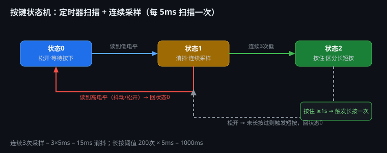

# 学习笔记 | 2026-08-13

## 今日主题：按键检测体系 · 软件定时器 · 结构体按键驱动 · 短按/长按 · 电机控制

> 工程：`6-5PWM电机 (定时器扫描+连续采样)` | 芯片：STM32F103C8T6 | 标准库 V3.5
> 本日内容：从"按键检查有哪些方法"的系统整理，到动手实现**定时器扫描+连续采样消抖+短按/长按**的完整按键驱动，并接入电机方向/速度控制，全部落地到工程。

---

## 一、核心知识点

### 1.1 按键检测完整体系（今日系统梳理）

按键检测可以拆成**两个独立维度**，先分类再组合：

```text
按键检测
├── ① 扫描方式（多久看一次电平）
│   ├── 主循环扫描：项目简单、主循环无耗时任务时用
│   ├── 定时器扫描：固定周期（如 5ms）扫描 ← 本工程采用
│   └── 外部中断：边沿触发，适合唤醒/低功耗
└── ② 消抖方式（怎么确认不是抖动）
    ├── 阻塞延时：Delay_ms(20) 后再确认（阻塞 CPU）
    ├── 时间戳消抖：记录按下时间，主循环查时间差 ≥20ms
    └── 连续采样消抖：固定周期采样 N 次一致才确认 ← 本工程采用
```

**组合原则**：扫描方式决定"什么时候看"，消抖方式决定"怎么判断"。常见组合：

| 组合 | 适用场景 |
|---|---|
| 主循环扫描 + 阻塞延时 | 学习实验、单按键 |
| 定时器扫描 + 连续采样 | 多按键、正式产品（本工程） |
| 定时器扫描 + 时间戳 | 有 SysTick 时间基准即可 |
| 外部中断 + 时间戳 | 低功耗唤醒 |

### 1.2 主循环读取电平的一个关键坑

> 15:30~16:02 讨论：如果主循环过长，按下按键时还没执行到读取电平的代码，等执行到时可能已经松开了——电平检查会漏掉这次按键。

**原因**：主循环读取是"抽查"，主循环越慢、漏检概率越大。
**解法**：按键检测不能依赖主循环节奏，要用**固定周期定时器扫描**（如 5ms 一次），与主循环耗时无关。

### 1.3 软件定时器（SysTick 1ms 心跳 + 定时器池）

用 1 个 SysTick 派生 N 路"虚拟定时器"，避免每路都开硬件定时器：

```text
SysTick 1ms 中断 → SoftTimer_Update() 遍历 Timers[] 池
每路：Period(周期ms) + Counter(计数) + Flag(到点标志)
主循环：if (Timers[i].Flag) { Flag=0; 执行任务; }
```

- **5ms 扫描**：`SysTick_Config(SystemCoreClock / 200)`（72MHz/200 = 360000 → 5ms）
- 新增定时任务：只需在 Systick.h 加一个编号宏，如 `#define TIMER_LED 1`，`TIMER_COUNT` 相应 +1
- 中断里只做 `SoftTimer_Update()`，**具体任务放主循环**，中断保持极短

### 1.4 多按键驱动：结构体数组 + 函数指针

> 18:18 讨论：3 个按键如果每个都写一遍检测代码，重复太多。解法：把按键的属性和行为封装成结构体数组。

```c
typedef struct {
    GPIO_TypeDef *GPIOx;        /* 端口 */
    uint16_t      Pin;          /* 引脚 */
    uint8_t       state;        /* 状态机：0松开 1消抖 2按住 */
    uint8_t       count;        /* 消抖采样计数 */
    uint16_t      hold_count;   /* 按住计时（每5ms+1） */
    uint8_t       long_done;    /* 长按已触发标记 */
    void (*ShortAction)(void);  /* 短按回调函数指针 */
    void (*LongAction)(void);   /* 长按回调函数指针 */
} Key_TypeDef;

Key_TypeDef Keys[KEY_NUM] = {
    {GPIOA, GPIO_Pin_3, 0,0,0,0, Key1_Short, Key1_Long},
    {GPIOA, GPIO_Pin_5, 0,0,0,0, Key2_Short, Key2_Long},
    {GPIOA, GPIO_Pin_7, 0,0,0,0, Key3_Short, Key3_Long},
};
```

**函数指针 `void (*ShortAction)(void)`**：指向"这个按键按下后要执行的函数"。好处：
- 数组元素各自绑定不同行为，`Key_Scan()` 统一循环处理，无需 switch 分支
- 新增按键 = 加一个数组元素 + 两个回调函数，改动最小

### 1.5 按键三态状态机 + 短按/长按



| 状态 | 含义 | 进入 | 退出 |
|---|---|---|---|
| 0 | 松开·等待按下 | 上电/松开 | 读到低 → 状态1 |
| 1 | 消抖·连续采样 | 检测到按下 | 连续3次低 → 状态2；读到高 → 回0 |
| 2 | 按住·区分长短按 | 消抖完成 | 按住≥1s 触发长按；松开时未长按则触发短按 → 回0 |

- 消抖：3 次 × 5ms = **15ms**（连续采样）
- 长按阈值：200 次 × 5ms = **1000ms**
- 短按：松开瞬间判断 `long_done == 0` 才触发（防止长按后松手又触发短按）
- 长按：`long_done` 标记保证按住 5 秒也只触发一次

### 1.6 电机控制分层

```text
Key.c 按键回调 → Motor_Direction(±1) 切换方向
                → Motor_Speed(speed) 调速度（内部刷新 OLED + PWM）
```

- `Motor_Direction(1)` 正转 / `Motor_Direction(-1)` 反转
- `Motor_Speed(0~99)`：`OLED_ShowNum` 显示速度 + `PWM_Changevalue` 改占空比

### 1.7 顺带：GitHub 同步工作流（已成体系）

- 用户 GitHub：`xyu-06/STM32f103c8t6project`（仓库名注意大写）
- 本地镜像：`D:\STM32f103c8t6project`
- "上传github" = 检查新工程（keil32project + VScodeSTM项目文件夹）→ 同步到仓库对应目录 → 检查新笔记 → 更新 README → commit & push
- 此流程已固化为 skill（github-stm32-sync），以后说"上传github"自动执行

---

## 二、重要代码参考（可直接抄）

### 2.1 Systick.c —— 1ms 心跳 + 软件定时器池

```c
#include "stm32f10x.h"
#include "Systick.h"

volatile uint32_t Systick_Count = 0;          /* 全局 1ms 时间戳 */
SoftTimer_TypeDef Timers[TIMER_COUNT];        /* 软件定时器池 */

void Systick_Init(void)
{
    SysTick_Config(SystemCoreClock / 1000);   /* 72MHz/1000 = 1ms */
}

void SoftTimer_Start(uint8_t idx, uint16_t period)
{
    Timers[idx].Period  = period;
    Timers[idx].Counter = 0;
    Timers[idx].Flag    = 0;
}

void SoftTimer_Update(void)   /* 在 SysTick_Handler 中每 1ms 调用 */
{
    for (uint8_t i = 0; i < TIMER_COUNT; i++)
    {
        if (++Timers[i].Counter >= Timers[i].Period)  /* 用 >= 防跳变漏判 */
        {
            Timers[i].Counter = 0;
            Timers[i].Flag    = 1;
        }
    }
}
```

### 2.2 Systick.h —— 结构体 + 编号宏 + extern 声明

```c
typedef struct {
    uint16_t Period;            /* 定时周期，单位 ms */
    uint16_t Counter;           /* 当前计数值，每 1ms 自增 */
    volatile uint8_t Flag;      /* 到点标志：1=定时到 */
} SoftTimer_TypeDef;

#define TIMER_KEY_SCAN  0       /* 按键扫描定时器 */
#define TIMER_COUNT     1       /* 定时器总个数 */

extern SoftTimer_TypeDef Timers[TIMER_COUNT];  /* 数组定义在 .c，这里只声明 */
```

> 💡 `extern` 的作用：数组实际定义在 Systick.c，其他文件（如 main.c）要访问它，必须先在头文件里 extern 声明。**声明 ≠ 定义**：extern 不分配内存，只是告诉编译器"这个数组在别处有定义"。

### 2.3 stm32f10x_it.c —— 中断只做一件事

```c
extern void SoftTimer_Update(void);

void SysTick_Handler(void)
{
    Systick_Count++;        /* 时间戳 +1ms */
    SoftTimer_Update();     /* 更新所有软件定时器 */
}
```

### 2.4 Key.c —— 结构体数组 + 三态状态机

```c
#include "stm32f10x.h"
#include "Motor.h"
#include "OLED.h"
#include "Key.h"

static int8_t  direction = 1;      /* 方向状态：1正 -1反 */
static uint8_t speed = 40;         /* 速度 0~99 */

/* KEY1(PA3)：短按切方向，长按停止 */
static void Key1_Short(void) { direction = -direction; Motor_Direction(direction); }
static void Key1_Long(void)  { speed = 0; Motor_Speed(speed); }

/* KEY2(PA5)：短按+20，长按直接最大 */
static void Key2_Short(void) { speed += 20; if (speed > 99) speed = 99; Motor_Speed(speed); }
static void Key2_Long(void)  { speed = 99; Motor_Speed(speed); }

/* KEY3(PA7)：短按-20，长按停止 */
static void Key3_Short(void) { speed = (speed > 20) ? speed - 20 : 0; Motor_Speed(speed); }
static void Key3_Long(void)  { speed = 0; Motor_Speed(speed); }

static Key_TypeDef Keys[KEY_NUM] = {
    {GPIOA, GPIO_Pin_3, 0, 0, 0, 0, Key1_Short, Key1_Long},
    {GPIOA, GPIO_Pin_5, 0, 0, 0, 0, Key2_Short, Key2_Long},
    {GPIOA, GPIO_Pin_7, 0, 0, 0, 0, Key3_Short, Key3_Long},
};

void Key_Init(void)
{
    RCC_APB2PeriphClockCmd(RCC_APB2Periph_GPIOA, ENABLE);
    GPIO_InitTypeDef GPIO_InitStruct;
    GPIO_InitStruct.GPIO_Mode  = GPIO_Mode_IPU;   /* 上拉输入 */
    GPIO_InitStruct.GPIO_Pin   = GPIO_Pin_3 | GPIO_Pin_5 | GPIO_Pin_7;
    GPIO_InitStruct.GPIO_Speed = GPIO_Speed_50MHz;
    GPIO_Init(GPIOA, &GPIO_InitStruct);

    Motor_Direction(direction);
    Motor_Speed(speed);
}

/* 扫描函数：每 5ms 调用一次（主循环查询 TIMER_KEY_SCAN 标志） */
void Key_Scan(void)
{
    for (uint8_t i = 0; i < KEY_NUM; i++)
    {
        uint8_t level = GPIO_ReadInputDataBit(Keys[i].GPIOx, Keys[i].Pin);
        switch (Keys[i].state)
        {
        case 0:   /* 松开：等待按下 */
            if (level == RESET) { Keys[i].state = 1; Keys[i].count = 0; }
            break;
        case 1:   /* 消抖：连续3次低电平 */
            if (level == RESET) {
                if (++Keys[i].count >= 3) {
                    Keys[i].state = 2;
                    Keys[i].hold_count = 0;
                    Keys[i].long_done = 0;
                }
            } else Keys[i].state = 0;   /* 抖动/松开回0 */
            break;
        case 2:   /* 按住：区分短按/长按 */
            if (level == RESET) {
                if (++Keys[i].hold_count >= LONG_PRESS_TICKS) {
                    if (Keys[i].long_done == 0) {
                        Keys[i].long_done = 1;
                        Keys[i].LongAction();    /* 长按只触发一次 */
                    }
                }
            } else {
                if (Keys[i].long_done == 0)
                    Keys[i].ShortAction();       /* 没长按过 → 短按 */
                Keys[i].state = 0;
            }
            break;
        }
    }
}
```

### 2.5 main.c —— 主循环查询定时器标志

```c
#include "stm32f10x.h"
#include "OLED.h"
#include "Motor.h"
#include "Key.h"
#include "Systick.h"

int main(void)
{
    Systick_Init();
    SoftTimer_Start(TIMER_KEY_SCAN, 5);   /* 按键扫描 5ms 周期 */
    OLED_Init();
    Motor_Init();
    Key_Init();

    while (1)
    {
        if (Timers[TIMER_KEY_SCAN].Flag)
        {
            Timers[TIMER_KEY_SCAN].Flag = 0;
            Key_Scan();                   /* 每 5ms 扫一次按键 */
        }
    }
}
```

### 2.6 Motor.c —— 方向 + 速度

```c
void Motor_Direction(int8_t direction)   /* 1正转 -1反转 */
{
    if (direction == 1) {
        GPIO_SetBits(GPIOA, GPIO_Pin_10);
        GPIO_ResetBits(GPIOA, GPIO_Pin_11);
    }
    if (direction == -1) {
        GPIO_SetBits(GPIOA, GPIO_Pin_11);
        GPIO_ResetBits(GPIOA, GPIO_Pin_10);
    }
}

void Motor_Speed(uint8_t speed)
{
    OLED_ShowNum(1, 7, speed, 2);   /* OLED 显示当前速度 */
    PWM_Changevalue(speed);         /* 改 PWM 占空比 */
}
```

### 2.7 按键功能映射表

| 按键 | 引脚 | 短按 | 长按（≥1s） |
|---|---|---|---|
| KEY1 | PA3 | 切换方向（正↔反） | 速度归 0 停止 |
| KEY2 | PA5 | 速度 +20（封顶 99） | 直接最大 99 |
| KEY3 | PA7 | 速度 -20（最低 0） | 停止 |

---

## 三、今日踩的坑

| 坑 | 现象 | 原因 | 解法 |
|---|---|---|---|
| 主循环漏检按键 | 快速点按有时没反应 | 主循环过长，读取电平时机错过按下 | 固定周期定时器扫描（5ms） |
| 长按重复触发 | 按住 3 秒触发多次 | 没标记已触发 | `long_done` 标记，只触发一次 |
| 长按后松手又触发短按 | 长按+短按都执行 | 松开时没判断 long_done | 松开时 `if (long_done == 0)` 才触发短按 |
| 定时器计数 `==` 漏判 | 偶尔丢节拍 | 中断延迟导致计数跳变 | 用 `>=` 判断到点 |
| 加减速"一次到顶/到底" | 按一下速度直接最大或归零 | speed 变量作用域/初始化问题，或回调逻辑写错 | 检查 speed 是否 static、回调里步进量是否正确 |
| 未赋值结构体数组"有值" | Keys[] 初始状态不确定 | 结构体数组元素按声明顺序**显式初始化**了 | 数组初始化列表按宏定义顺序写全 |
| 新建 .c/.h 未加入 Keil 工程 | 编译报 undefined symbol | Keil 只编译 .uvprojx 登记的文件 | Keil 右键分组 Add Existing Files |
| 断点调试时 20:00 API 402 | 对话中断、上下文压缩 | 余额不足 → 压缩失败 → 历史重建 | 及时续费；记录在 agent.log 可恢复 |

---

## 四、容易搞混的概念

### 4.1 扫描方式 vs 消抖方式（两个独立维度）

- 扫描方式回答"**什么时候看电平**"：主循环 / 定时器 / 中断
- 消抖方式回答"**怎么确认不是抖动**"：阻塞延时 / 时间戳 / 连续采样
- 两者可自由组合，别混为一谈

### 4.2 消抖计数 count vs 按住计时 hold_count

- `count`：状态1 用，连续 3 次 = 15ms 消抖
- `hold_count`：状态2 用，累加到 200 = 1s 长按
两个计数器职责不同，别混用。

### 4.3 函数指针 vs 普通函数调用

```c
void (*ShortAction)(void);   /* 函数指针：存的是函数的地址 */
ShortAction();               /* 调用：等价于直接调用它指向的函数 */
```

- 好处：结构体数组里每个按键绑定不同函数，循环里统一 `Keys[i].ShortAction()` 调用，无需 switch

### 4.4 定义 vs 声明（extern）

- **定义**：`SoftTimer_TypeDef Timers[TIMER_COUNT];`（分配内存，只能有一处）
- **声明**：`extern SoftTimer_TypeDef Timers[TIMER_COUNT];`（告诉编译器存在，不分配内存）
- .h 里写 extern 声明，.c 里写定义——多个 .c 文件都能访问，但只有一处分配内存

### 4.5 SysTick 定时 5ms 的计算

```text
SysTick_Config(重装值) → 中断频率 = SystemCoreClock / 重装值
5ms：重装值 = 72MHz / 200 = 360000
1ms：重装值 = 72MHz / 1000 = 72000
```

---

## 五、调试方法论

### 5.1 编译验证（Keil 命令行）

```bash
cd '/d/VScodeSTM项目文件夹/6-5PWM电机 (定时器扫描+连续采样)'
'/d/keil/UV4/UV4.exe' -b project.uvprojx -j0 -o build.log
python -c "print(open('build.log',errors='ignore').read()[-2000:])"
```

本工程验证：**0 Error(s), 0 Warning(s)** ✅

### 5.2 状态机调试三步法

1. **打印状态**：OLED 显示 `state` / `count` / `hold_count`，看状态转移是否符合预期
2. **单键调试**：先 `KEY_NUM=1` 只留 KEY1，确认短按/长按都对，再开其余键
3. **时间轴推演**：抖动 5ms、按住 300ms、松开——手推每个 5ms 节拍的状态变化，与 OLED 对照

### 5.3 短按/长按联调 checklist

- [ ] 短按一次 → 只触发 ShortAction 一次
- [ ] 长按 1s → 触发 LongAction 一次，松手不触发 ShortAction
- [ ] 按住 3s → LongAction 仍只一次
- [ ] 快速连按 → 每次都能识别（消抖不吞键）

---

## 六、待办 / 下一步

- [ ] 长按连发：按住不放每 500ms 连续加速（把 long_done 换成"上次触发时间戳"）
- [ ] 消抖次数/长按阈值做成可配置宏，方便调手感
- [ ] 把"软件定时器 + 结构体按键"封装成通用驱动，复制到后续工程直接用
- [ ] 验证 KEY2/KEY3 步进逻辑：确认从 40 起步 +20/-20 不会一次到顶/归零
- [ ] 完成 19:52 未完成的代码检查（当时 API 402 中断）
